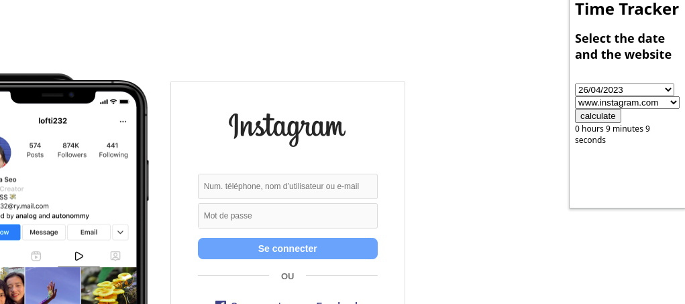

# TimeTracker

  

## created by Alpha, Johan and Hugo in Ada Tech School.

This chrome extension is a time tracker that tracks the total time spent on each website.

When activated it records your browser activity in the chrome storage API.

The pop-up allows you to to browse your time spent history by date and gives you some informations about an event in this particular day.
# extension_chrome_time_tracker
